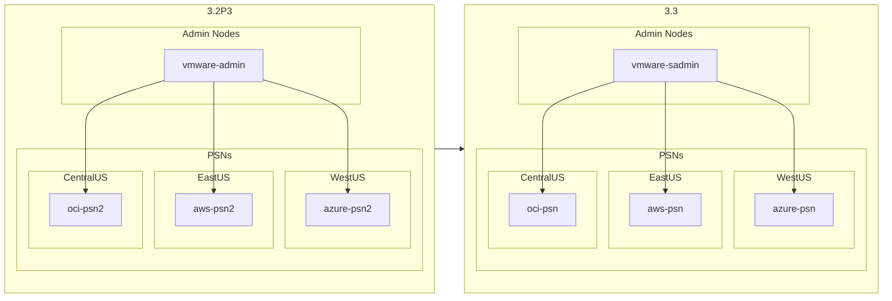

# Upgrade_ISE_in_Hybrid_Cloud/iteration_1

This folder is the second to be run in the Upgrade process.  It contains all the Playbooks necessary to deregister the "primary" PSNs from the ISE 3.2 deployment, delete them, create ISE 3.3 PSNs and register them to the ISE 3.3 deployment.  Node Groups are created and the PSNs are assigned to them.

|Playbook|Function|
|---|---|
|01-remove_nodes.yaml|Deregisters the following nodes from the ISE 3.2 deployment - `azure-psn` - `oci-psn` - `aws-psn`|
|02-delete_azure_32.yaml|Deletes the `azure-psn`, NIC, and OS disk from Azure|
|03-delete_oci_psn.yaml|Deletes `oci-psn` from OCI|
|04-delete_aws_psn.yaml|Deletes `aws-psn` from AWS|
|05-create_azure_33.yaml|Creates an ISE 3.3 instance on Azure|
|06-create_oci_33.yaml|Creates an ISE 3.3 instance on OCI|
|07-create_aws_33.yaml|Creates an ISE 3.3 instance on AWS|
|08-wait_for_ise_login.yaml|Waits for https://{{isenode}}.securitydemo.net/admin/login.jsp to be accessible, meaning that the Application Server process is `Running`|
|09-enable_api.yaml|Enable ERS API and Open API on the new nodes|
|10-create_ftp_respository.yaml|Creates a repository named `FTP` on the new nodes|
|11-patch_install.yaml|Placeholder playbook to use when ISE 3.3 patches are released|
|12-add_nodes.yaml|Promotes `vmware-sadmin` from STANDALONE to Primary Admin, adds the new nodes to this deployment and assigns them to Node Groups|
|13-iteration_1_complete.yaml|Visual and email notification that this iteration is complete|
|main.yaml|Uses `ansible.builtin.import_playbook` to run all the necessary Playbooks|

This folder of Playbooks will remove one PSN from each Node Group of the ISE 3.2 Patch 3 deployment and install new 3.3 PSNs with the same hostnames and IP addresses, create Node Groups and add PSNs to them, and change the roles and services on `vmware-sadmin`

## License

MIT

## Author

Charlie Moreton, <https://github.com/ISEDemoLab>
