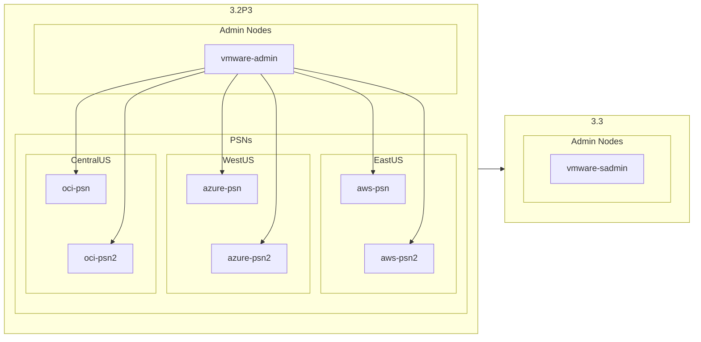

# Upgrade_ISE_in_Hybrid_Cloud/admin_1

This folder is the first to be run in the Upgrade process.  It contains all the Playbooks necessary to deregister the SPAN from the ISE 3.2 deployment and set it up as the basis for the ISE 3.3 upgraded deployment

|Playbook|Function|
|---|---|
|01-remove_sadmin.yaml|Deregister the Secondary Admin Node from the ISE 3.2 depoyment|
|02-delete_sadmin.yaml|Delete the Secondary Admin Node from VMware|
|03-setup-sadmin.yaml|Create a new VM and install ISE 3.3 using ZTP|
|04-enable-api.yaml|Enable ERS API and Open API on the new node|
|05-create_ftp_respository.yaml|Creates a repository named `FTP` on the new node|
|06-backup_and_restore.yaml|Creates a Configuration Backup from the ISE 3.2 Deployment and uses that backup to restore the configuration to the new ISE 3.3 node|
|secondary_admin.yaml|Uses `ansible.builtin.import_playbook` to run all the necessary Playbooks |

This folder of Playbooks will remove the Secondary Admin Node from the ISE 3.2 Patch 3 deployment and install an new 3.3 standalone node, then a backup will be created from the 3.2Patch3 deployment and restored onto the 3.3 `vmware-sadmin` node.

```sh

```

## License

MIT

## Author

Charlie Moreton, <https://github.com/ISEDemoLab>