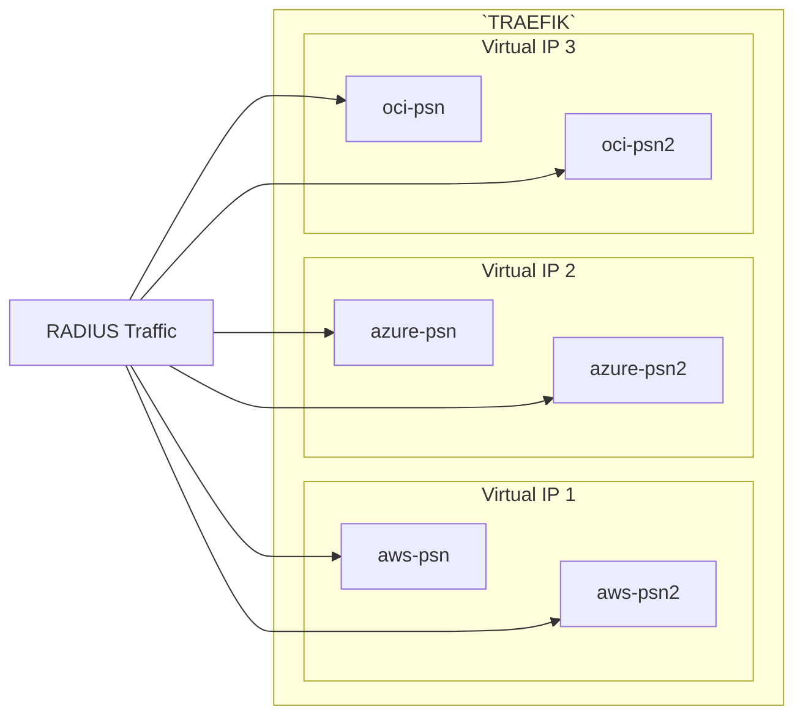
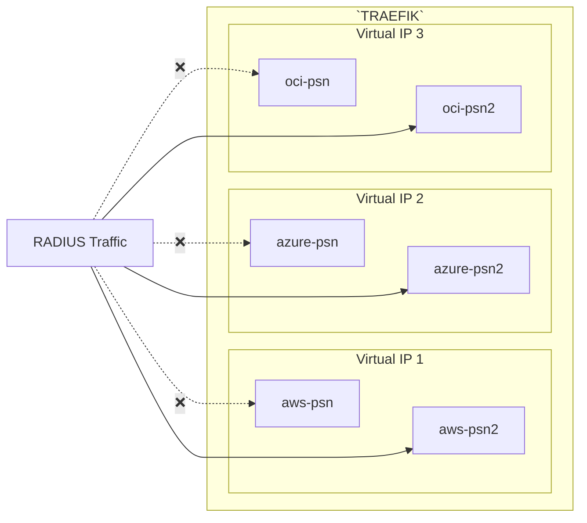
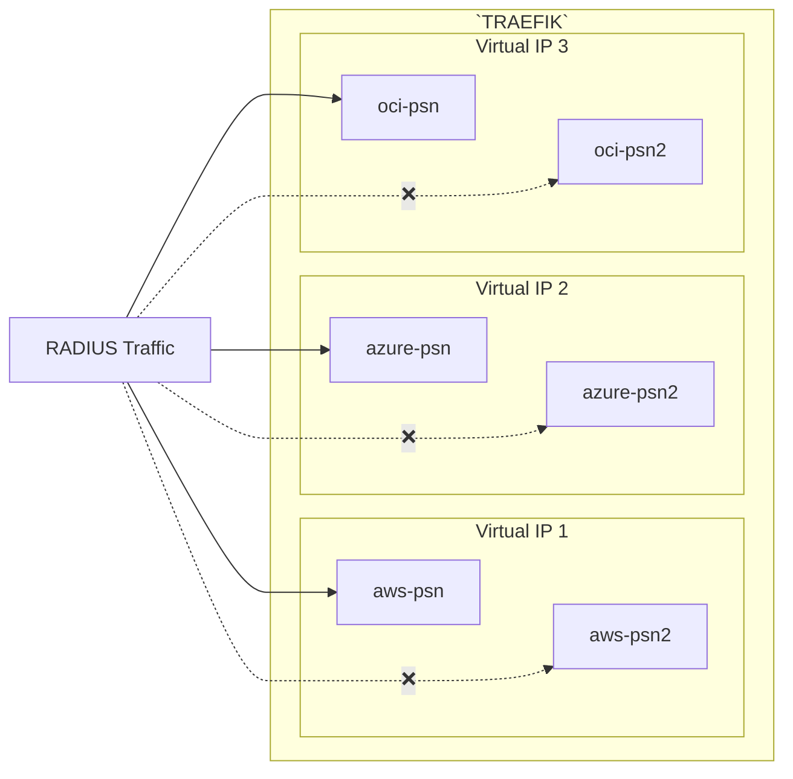

# Upgrade_ISE_in_Hybrid_Cloud/lb_config

This folder contains the files where all the variables that are used in the Playbooks are defined.

|File Name|Function|
|---|---|
|traefik/radius.yaml|Backup of the currently running RADIUS config on the load balancer|
|01-iter_1_psns_in_lb.yaml|Disable the `iteration_1` PSNs in the Load Balancer|
|02-restore_psns_in_lb.yaml|Restore the original RADIUS configuration in the Load Balancer|
|03-iter_2_psns_in_lb.yaml|Disable the `iteration_2` PSNs in the Load Balancer|
|main.yaml|Sample file to show where the load balancer confiruations would be used|
|radius_1.yaml|Radius configuration file that is used to disable the `iteration_1` PSNs|
|radius_2.yaml|Radius configuration file that is used to disable the `iteration_2` PSNs|
|radius_og.yaml|It's always a good idea to have a backup of your working config - just in case|

When it comes to upgrading ISE, one of the most popular additions to the ISE deployment is a Load Balancer.  If you've seen my webinar on [Cloud Based Load Balancers with ISE](https://www.youtube.com/watch?v=SSOa75rGofk) or have read my companion article to that webinar [RADIUS Load Balancing for ISE](https://cs.co/ise-lb), you'll see how important a load balancer can be!

This folder will show you how to update the RADIUS config for the Traefik `open source` load balancer I used in that webinar.  The theory remains the same for all other load balancers, but I still have this one running.

This is how my load balancer is currently configured

The `01-iter_1_psns_in_lb.yaml` file will disable the entries for the backend servers as shown in this diagram

The `01-iter_2_psns_in_lb.yaml` file will disable the entries for the backend servers as shown in this diagram.  The great thing about Traefik's dynamic configuration is that if you copy this file over the previous file, it will enable the previously disabled PSNs as it disables those shown below.

## License

MIT

## Author

Charlie Moreton, <https://github.com/ISEDemoLab>